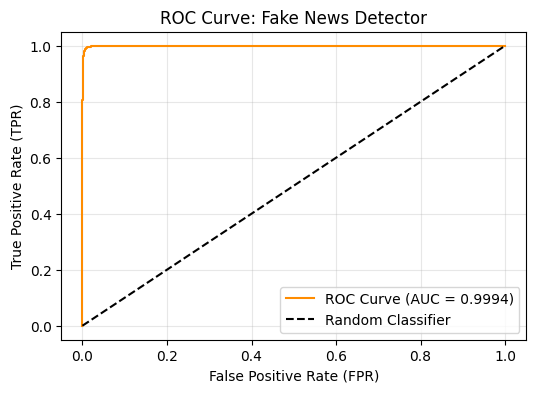
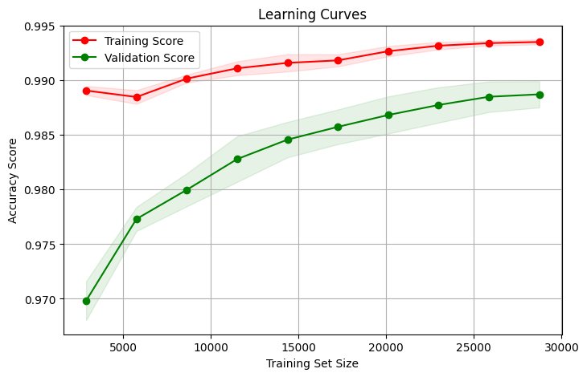
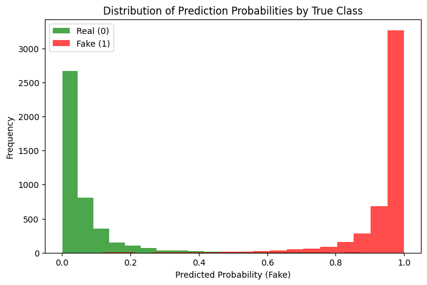
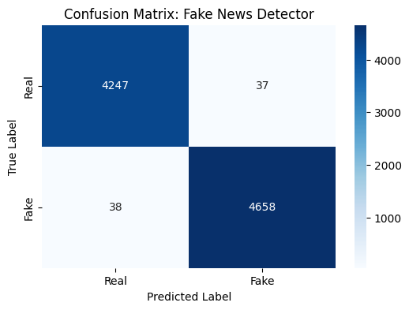

Fake News Detector — Project Presentation

Author: (Your name)
Role: Data Scientist
Date: (Presentation date)

Overview / Objective

Build a classifier that distinguishes fake vs real news articles.

Deliverables

Cleaned dataset and preprocessing pipeline (stemmed_dataset.csv), NOTE THAT THIS FILE IS NOT INCLUDED WITHIN THE REPO BUT IT CAN EASILY BE GENERATED BY RUNNIGN THE CODES.

Baseline model: Logistic Regression

Evaluation: confusion matrix, ROC, PR curve, learning curves

Saved artifacts for deployment: tfidf_vectorizer.pkl, fake_news_detector.pkl

Dataset (source & composition)
https://www.kaggle.com/datasets/clmentbisaillon/fake-and-real-news-dataset?utm_source=chatgpt.com

Datasets used: Fake.csv and True.csv → combined into new_dataset.csv

Combined dataset summary (from the training run):

Total samples: 44898
Class distribution:
label
1    0.523
0    0.477
Name: proportion, dtype: float64

Sample records (first rows):

                                               title
0  As U.S. budget fight looms, Republicans flip t...
1  U.S. military to accept transgender recruits o...
2  Senior U.S. Republican senator: 'Let Mr. Muell...
3  FBI Russia probe helped by Australian diplomat...
4  Trump wants Postal Service to charge 'much mor...

                                                text       subject  label
0  WASHINGTON (Reuters) - The head of a conservat...  politicsNews      0
1  WASHINGTON (Reuters) - Transgender people will...  politicsNews      0
2  WASHINGTON (Reuters) - The special counsel inv...  politicsNews      0
3  WASHINGTON (Reuters) - Trump campaign adviser ...  politicsNews      0
4  SEATTLE/WASHINGTON (Reuters) - President Donal...  politicsNews      0

Notes: dataset is roughly balanced in this run (~52.3% fake, 47.7% real).

Preprocessing pipeline (what was applied & why)

Inputs combined → new feature content: title + text + subject

Pipeline applied to content:

Concatenate fields — more signal (title often contains high-signal tokens).

Lowercase & remove non-letters — normalize tokens and remove punctuation/noise.

Stopword removal (NLTK stopwords) — removes high-frequency low-information tokens.

Stemming (PorterStemmer) — reduces inflectional variants to stems to lower sparsity.

Save stemmed dataset → stemmed_dataset.csv (reproducibility).

Reasoning: Classic NLP preprocessing reduces vocabulary size and noise, improving TF-IDF signal and making linear model weights more meaningful.

Example stopwords (printed in run):

['a', 'about', 'above', 'after', 'again', 'yours', 'yourself', 'yourselves', "you've", ...]

Example of stemmed content (first rows):

0    u budget fight loom republican flip fiscal scr...
1    u militari accept transgend recruit monday pen...
2    senior u republican senat let mr mueller job w...
3    fbi russia probe help australian diplomat tip ...
4    trump want postal servic charg much amazon shi...
...
44893 mcpain john mccain furiou iran treat us sailor...
44894 justic yahoo settl e mail privaci class action...

Feature engineering — TF-IDF

Used TfidfVectorizer() on the preprocessed content.

Why TF-IDF?

Captures importance of terms relative to corpus frequency (downweights ubiquitous words).

Produces a sparse numeric matrix suited to linear models (fast & memory-efficient).

Effective strong baseline for text classification.

Artifact saved: tfidf_vectorizer.pkl
(Printout from run: Vectorizer saved!)

Train / test split & sampling

Split used:

train_test_split(..., test_size=0.2, stratify=news_dataset['label'], random_state=2)

Why stratify? preserves class distribution → stable metrics between train & test.

Why random_state? reproducible experiments.

Model choice — Logistic Regression

Model: LogisticRegression() (scikit-learn defaults)

Why Logistic Regression?

Interpretability: coefficients show term impact direction.

Efficiency: scales well for high-dimensional sparse TF-IDF features.

Strong baseline: quick to train and easy to regularize; commonly used as first pass for text tasks.

Training & saved artifacts

Training call:

model.fit(X_train, Y_train)

Saved artifacts

tfidf_vectorizer.pkl — TF-IDF vectorizer (joblib)

fake_news_detector.pkl — trained model (joblib)

Run printouts (examples from your run):

Vectorizer saved!
Trained model saved successfully as fake_news_detector.pkl! Ready for deployment.

Evaluation — what was computed & why

Metrics computed in code:

Accuracy (train & test)

Precision, recall, F1 (classification report)

Confusion matrix (heatmap)

ROC-AUC and ROC curve

Precision-Recall curve + Average Precision

Learning curves (diagnose bias/variance)

Distribution of predicted probabilities

Why these metrics?

Accuracy: overall correctness

Precision / Recall / F1: class-wise performance (important for fake-news trade-offs)

ROC & PR: threshold-independent views; PR is especially informative for class imbalance

Learning curves: reveal under/overfitting patterns

Predicted-prob distributions: show model calibration / separability

Placeholders: the code prints precise numeric metrics at runtime (accuracy, ROC-AUC, Average Precision). Replace the placeholders below with your run numbers when assembling slides.

ROC-AUC Score: 

Average Precision Score (AP): 

learning Curves: 

Distribution of predicting probabilities by true class: 

Confusion Matrix: 

Interpretation &  reading of results

Confusion matrix: choose operating point based on whether recall (catching fake) or precision (avoiding false alarms) is prioritized.

ROC vs PR: For imbalanced data PR and AP are often more informative for the positive (fake) class.

Learning curves:

If train ≫ val → overfitting (add regularization, collect more data, reduce model complexity).

If both low & close → underfitting WE then use richer features or a stronger model.

Calibration: If probabilities are poorly separated/calibrated, use Platt scaling or isotonic calibration.

Limitations & ethical considerations

Limitations

Dataset bias : site-specific wording and temporal drift.

Model may learn publication/source artifacts rather than true semantic signals.

Simple preprocessing (stemming) can remove useful nuance.

Ethics

False positives can hurt reputations; false negatives reduce usefulness.

Use human-in-the-loop for decisions with high harm potential.

Be transparent about confidence and model limitations.

Next steps & improvements

Try contextual embeddings (BERT/fine-tuning) to capture semantics.

Calibrate probability outputs for decision thresholds.

Add explainability (LIME/SHAP) for per-sample rationale.

Monitor in production for drift; implement retraining triggers.

Consider ensembling or transformer-based fine-tuning for improved performance.

Deployment plan (high level)

Bundle tfidf_vectorizer.pkl + fake_news_detector.pkl in service.

API workflow:

Client sends article → preprocessing → vectorize → model.predict_proba → return probability + explanation tokens.

How to reproduce

Create virtual env, install requirements (example):

python -m venv venv
source venv/bin/activate   # or venv\Scripts\activate on Windows
pip install -r requirements.txt

Run the notebook in ML-Model.py. this will produce new_dataset.csv and stemmed_dataset.csv and models. The models are also included you can safely delete them and rebuild/regenerate using the notebook.ipynb.

To expose the trained models via the api.
while your virtual env is still activated. change directory to backend folder and open the backend folder on the intergrated terminal (vs code).

the backend consists of two files:
            preprocess.py which preprocesses the inputs from the front-end and main.py which is the actual FastAPI that you can run on the terminal using python main.py

after that you can open the front-end folder in intergrated terminal (make sure your virtual enviroment is active in this terminal.)

there is app.py which is a streamlit app that test the code using the api . there is also the app folder which is a react + vite front-end for testing the aplication which you can also access using https://fake-news-detector-ef6d7.web.app/ on the browser.

note that the front end is wired to the hosted API so no need to run it.

Summary of the notebook
Loads Fake.csv + True.csv

Concatenates into new_dataset.csv

Creates content, applies stemming & stopword removal

Fits TfidfVectorizer → tfidf_vectorizer.pkl

Fits LogisticRegression → fake_news_detector.pkl

Produces plots (save with plt.savefig(...))

Appendix — Run outputs. You should see something like :
Total samples: 44898
Class distribution:
label
1    0.523
0    0.477
Name: proportion, dtype: float64

Sample records: (title/text/subject/label printed earlier)

Vectorizer saved!
... (plots generated by code)
Trained model saved successfully as fake_news_detector.pkl! Ready for deployment.

artifacts
Notebook: (provide filename or link)
Artifacts: tfidf_vectorizer.pkl, fake_news_detector.pkl, stemmed_dataset.csv
